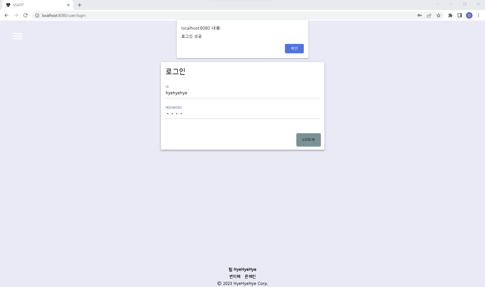

## SSAFY 9기 1학기 최종 관통 프로젝트  

✨ 팀명 혜혜혜  
✨ 팀장 [윤혜민](https://github.com/hyeii) 팀원 [변지혜](https://github.com/j-byun)  

### 역할 분담

- 윤혜민    
    User/Follow 관련 기능 Back/Front 개발  
- 변지혜    
    Video/Review/Like 관련 기능 Back/Front 개발

## 프로젝트 목표  
SSAFIT 프로젝트 :: 운동 영상을 기본 주제로 BackEnd와 FrontEnd를 모두 활용한 웹사이트를 제작한다.  

## 사용 스택  
- Database  
    - MySQL 
- Language  
    - Java  
    - Javascript    
- Framework 
    - Spring    
    - Vue   
- Library   
    - Vuetify   
- API   
    - Youtube Search    

## 목업  
- 로그인 관련 목업  
  
사용자 로그인 여부에 따라 표시되는 메뉴가 달라진다.  

- 영상 정보 및 사용자 관련 기능  
  
영상의 상세 페이지와 사용자의 마이페이지, 메시지 관련 항목을 구현해보았다.  

### ERD   

### UML   

## BACKEND : MAPPING PATH 요약
6개의 컨트롤러를 기반으로 다양한 기능을 수행하도록 구현하였다.   

1. Video 

|메소드|CRUD|기능|경로|
|---|---|---|---|
|selectAll|GET|전체 비디오 리스트 조회|/video|
|selectOne|GET|한 개의 비디오 상세 정보 가져오기|/video/{no}|
|updateLikeCnt|PUT|좋아요 수 1 증가/감소시키기|/video/{no}|
|selectMyLikeList|GET|내가 좋아요 한 영상 리스트 조회|/video/likelist/{userNo}|
  

2. User  

|메소드|CRUD|기능|경로|
|---|---|---|---|
|insertUser|POST|유저 등록|/user|
|selectOne|GET|한명의 유저 정보 가져오기 |/user/{no}|
|selectAll|GET|전체 사용자 목록 조회|/user|
|updateUser|PUT|회원정보 수정|/user|
|updateExp|PUT|사용자 경험치 획득|/user/{no}|
|deleteUser|DELETE|회원탈퇴|/user/{no}|
|selectFollowList|GET|내가 팔로우 한 / 나를 팔로우 한 유저 정보 가져오기|/user/follow/{userNo}|

3. Review  

|메소드|CRUD|기능|경로|
|---|---|---|---|
|selectVideoReviews|GET|조회된 비디오의 전체 리뷰 리스트 가져오기|/review/{videoNo}|
|insertReview|POST|리뷰 등록하기|/review|
|updateReview|PUT|리뷰 수정하기|/review/{no}|
|deleteReview|DELETE|리뷰 삭제하기|/review/{no}|

4. Message  

|메소드|CRUD|기능|경로|
|---|---|---|---|
|insertMessage|POST|메세지 전송하기|/message|
|selectMyMessages|GET|나에게 온/ 내가 보낸 전체 메세지 조회하기|/message/mymessage/{userNo}|
|selectOne|GET|선택된 메세지의 상세정보 조회|/message/{no}|
|checkMessage|PUT|메세지 읽음 표시하기|/message/{no}|

5. Follow  

|메소드|CRUD|기능|경로|
|---|---|---|---|
|insertFollow|POST|팔로우 등록하기|/follow|
|deleteFollow|DELETE|팔로우 삭제하기|/follow|

6. Like  

|메소드|CRUD|기능|경로|
|---|---|---|---|
|insertLike|POST|좋아요 등록하기|/like|
|deleteLike|DELETE|좋아요 삭제하기|/like|

## FRONTEND : COMPONENTS 요약
VueRouter를 기반으로 다양한 컴포넌트를 출력하도록 구현하였다.   

1. Video 

|컴포넌트명|기능|경로|
|---|---|---|
|VideoView|비디오 뷰|/video|
|VideoList|전체 비디오 목록|/video|
|VideoDetail|비디오 상세 정보|/video/detail/{videoNo}|

2. User  

|컴포넌트명|기능|경로|
|---|---|---|
|UserView|유저 뷰|/user|
|UserList|전체 유저 목록|/user|
|UserLogin|유저 로그인 화면|/user/login|
|userSignup|유저 회원가입|/user/signup|
|UserMyPage|유저 마이페이지|/user/myPage|
|UserUpdate|유저 정보 수정|/user/update|
|UserDetail|유저 상세정보 조회||
|UserFollower|나를 팔로우한 유저 목록 출력||
|UserFollowee|내가 팔로우한 유저 목록 출력||
|UserLikesList|내가 좋아요 한 비디오 목록 출력||

3. Review  

|컴포넌트명|기능|경로|
|---|---|---|
|ReviewView|리뷰 뷰|/review|
|VideoReviewList|선택한 비디오에 달린 리뷰 목록||
|VideoReviewCreate|선택한 비디오 작성할 리뷰 입력||

4. Message  

|컴포넌트명|기능|경로|
|---|---|---|
|MessageView|메세지 뷰|/message|
|MessageList|전체 메세지 리스트|/message|
|MessageDetail|메세지 상세 정보 조회|/message/detail/{messageNo}|
|MessageCreate|메세지 작성|/message/create|

## 주요 구현 기능
- 등록된 운동 영상 목록 확인, 다양한 검색 지원  
- 각 영상에 대한 리뷰 작성 및 삭제, 영상 좋아요 기능 구현, 리뷰 작성 시 경험치 상승  
- 사용자 회원 가입, 로그인, 로그아웃, 팔로우 및 다이렉트 메세지 구현  

### 메인 화면

- 내비게이션 바 : 로그인 하기 전과 후에 접근할 수 있는 메뉴가 달라진다.
    - 로그인 전
        
    - 로그인 후
        

### 회원 가입 및 로그인
  
입력된 사용자 정보로 회원가입을 진행한다.       
ID, 이메일, 닉네임 항목에 대해 사용자 DB data와 중복 확인을 진행한다.

- 로그인 기능 : 회원가입이 완료되면 로그인 화면으로 이동한다.       
    회원가입한 유저의 ID, 비밀번호가 일치하면 로그인에 성공한다.
      

### 영상 목록
   
- 검색 기능 : 영상 리스트의 모든 컬럼에 대해 검색 가능
    
- 정렬 기능 : 영상 리스트의 모든 컬럼에 대해 오름차순/내림차순 정렬 가능
    

### 영상 상세 화면
   
로그인이 되어있지 않아 좋아요 버튼 및 리뷰 목록이 비활성화 되어 있다.   

   
로그인 후 다시 영상 상세 화면에 진입하면 좋아요 버튼과 리뷰 목록이 정상적으로 출력된다.

- 좋아요 기능 : 해당 영상에 좋아요를 등록하거나 취소할 수 있다.
       
       

- 리뷰 기능 : 해당 영상에 리뷰를 작성하거나 삭제할 수 있다.     
    리뷰 삭제 버튼은 내가 작성한 리뷰일 때만 출력된다.
     
     

### 사용자 목록
   
내가 팔로우하고 있는 유저와, 팔로우하고있지 않은 유저가 구분되어 팔로우/언팔로우 버튼이 출력된다.   
현재 로그인 한 유저에는 버튼이 출력되지 않는다.     

- 팔로우 기능 : 다른 사용자를 팔로우/언팔로우 할 수 있다.       
     
     

### 사용자 마이페이지
 
사용자 상세정보 확인 및 수정 / 회원탈퇴 / 경험치 바 / 좋아하는 영상 / 팔로우 현황 / 메세지 관리 기능에 접근할 수 있다.      
경험치는 100을 기준으로 게이지 바가 채워진다.       
좋아하는 영상 카드 하단의 바로가기 버튼을 통해 해당 영상의 상세 페이지로 접근할 수 있다.        

- 사용자 정보 수정 기능 : 비밀번호 / 나이 / 키 / 몸무게를 수정할 수 있다.       
     

- 팔로잉/팔로워 리스트 확인 기능
     
     
    팔로잉 리스트에서 내가 팔로우하고있는 사용자에게 메세지 보내기 화면으로 진입할 수 있다.
     

### 메세지 목록
 

- 확인하고 싶은 메세지를 클릭해서 메세지 상세 정보 모달을 확인할 수 있다.
         
- 메세지 제목 검색 기능 : 수신/송신 메세지의 제목으로 메세지를 검색 할 수 있다.
       

## 보완 사항
- 아직 읽지 않은 메세지만 확인하는 기능
- 경험치가 100을 넘으면 레벨업하는 기능
- 사용자들이 소통할 수 있는 익명게시판 기능

## 개발 일지  

### **5/17**
- 프로젝트 구조 설계
- DB 설계  

### **5/18**
- Back 
    1. Model 하위 구조 구현
    2. User 관련 기능 구현
- Front
    1. Components 하위 구조 구현  

### **5/19**  
- Back
    1. Video 및 Review 관련 DTO, DAO, Service, RestController, Mapper 구현  
- Front  
    1. Views 하위 구조 파일 생성
    2. Components 하위 구조 => Board 구현
    3. store/index.js 추가 기능 구현 

### **5/20**  
- Back  
    1. User 및 Board 관련 DTO, DAO, Service, RestController, Mapper 구현  
- Front  
    1. Components 하위 구조 => User, Message 이하 폴더 구현  
    2. store/index.js 추가 기능 구현 

### **5/21**  
- Back  
    1. Message, Follow, Like 관련 DTO, DAO, Service, RestController, Mapper 구현  
- Front  
    1. Components 하위 구조 => Review 이하 폴더 구현  
    2. store/index.js 추가 기능 구현 

### **5/22**  
- Back  
    1. 전체 기능 작동 점검 및 디버깅  
- Front 
    1. Components 하위 구조 구현 및 router 설계 

### **5/23**
- Back  
    1. 전체 메소드 URL mapping 점검 및 Mapper.xml 점검
- Front  
    1. Video 목록 출력 및 하위 폴더 구현  
    2. User 상세 정보, Follow 관련 기능 구현  
    3. User간 메세지 기능 구현  

### **5/24**  
- Back  
    1. 메세지 읽음 표시 기능 구현  
- Front 
    1. 경험치 업데이트 기능 수정  
    2. 영상 좋아요 기능 구현 및 좋아요 리스트 출력
    3. 해당 사용자의 영상 리뷰 삭제 기능 구현  
    4. 기타 User 관련 예외처리  
    5. Vuetify 설치 및 적용 

### **5/25**  
- Back  
    1. Database 테이블 초기값 설정
- Front 
    1. 영상/사용자/메세지 리스트 v-data-table 적용
    2. v-navigation-drawer css 적용
    3. Footer 추가
    4. 전체 페이지에 대한 css 적용 및 수정정

